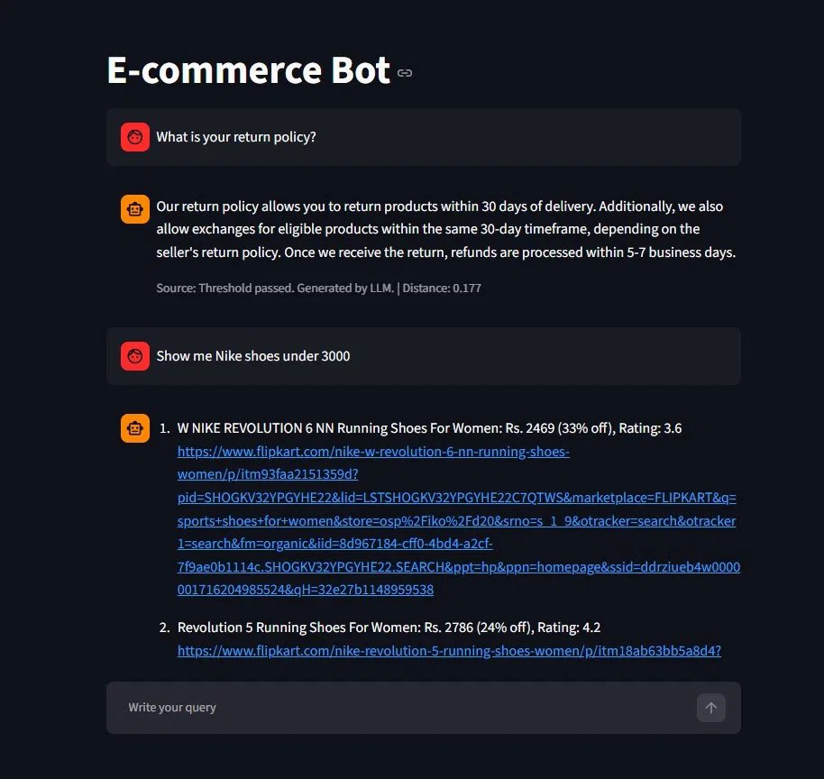
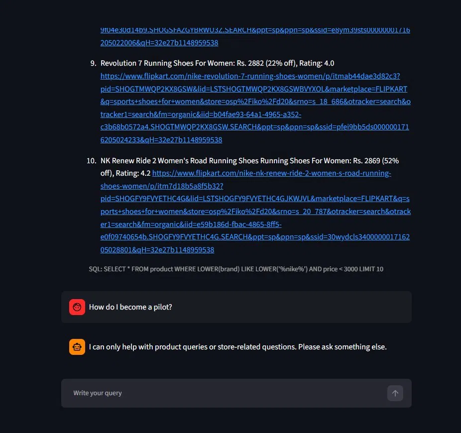

# E-Commerce GenAI Chatbot — Semantic Routing + RAG + Text-to-SQL

A conversational AI chatbot for an e-commerce platform (Flipkart) that answers two types of questions:
- **Policy & support questions** → answered via FAQ RAG (ChromaDB + Groq LLM)
- **Product search questions** → answered via Text-to-SQL (SQLite + Groq LLM)

A semantic router sits in front and decides which pipeline to invoke — or rejects the query entirely if it's out of scope.

---

## Architecture

```
User Query
    │
    ▼
┌─────────────────────┐
│   Semantic Router   │  ← sentence-transformers/all-MiniLM-L6-v2
│  (semantic-router)  │
└──────────┬──────────┘
           │
     ┌─────┴──────┐
     │            │
     ▼            ▼
  "faq"         "sql"         None → fallback message
     │            │
     ▼            ▼
┌─────────┐  ┌──────────────┐
│  FAQ    │  │  Text-to-SQL │
│  RAG    │  │   Pipeline   │
│Pipeline │  └──────┬───────┘
└────┬────┘         │
     │         1. LLM generates SQL
     │         2. SQLite executes it
1. Embed query   3. LLM converts
2. ChromaDB         results to
   similarity        natural language
   search
3. Threshold
   check (0.7)
4. LLM generates
   grounded answer
```

### Components

| Component | Role | Tech |
|-----------|------|------|
| `router.py` | Classifies query as `faq`, `sql`, or out-of-domain | `semantic-router`, HuggingFace encoder |
| `faq_2.py` | Retrieves relevant FAQ answers and generates a grounded response | ChromaDB, sentence-transformers, Groq |
| `sql.py` | Converts question to SQL, runs it, converts result to natural language | SQLite, Groq |
| `main.py` | Streamlit UI, session state, wires everything together | Streamlit |

### FAQ RAG Pipeline (faq_2.py)

```
Query → ChromaDB cosine similarity search → Distance threshold check (0.7)
      → If passed: build context from top-3 results → Groq LLM generates answer
      → If failed: return "I don't know" without hitting the LLM
```

The retrieval threshold acts as a cost-saving guard — unrelated queries never reach the LLM.

### Text-to-SQL Pipeline (sql.py)

```
Query → Groq LLM generates SQL (wrapped in <SQL> tags)
      → Regex extracts SQL → SQLite executes → Results capped at 10 rows
      → Groq LLM converts structured data to natural language answer
```

The LLM is instructed to return `NOT_RELEVANT` for questions outside the product schema, which is handled gracefully.

### Semantic Router (router.py)

Two routes are defined with hand-crafted utterances:

| Route | Score Threshold | Handles |
|-------|----------------|---------|
| `faq` | 0.2 | Return policy, refunds, tracking, payments, damaged products |
| `sql` | 0.3 | Product search, brand filters, price range, ratings, discounts |
| `None` | — | Anything else → fallback message |

---

## Project Structure

```
app/
├── main.py              # Streamlit app entry point
├── router.py            # Semantic router (faq / sql / None)
├── faq_2.py             # FAQ RAG pipeline
├── sql.py               # Text-to-SQL pipeline
├── db.sqlite            # SQLite product database
├── requirements.txt     # Pinned dependencies
├── .env                 # API keys (not committed)
└── resources/
    └── faq_data.csv     # FAQ dataset (question, answer columns)
```

---

## Demo

**FAQ query** ("What is your return policy?") and **SQL query** ("Show me Nike shoes under 3000"):



**SQL results** (10 Nike shoes with price and links) and **out-of-domain rejection** ("How do I become a pilot?"):



---

## Setup — Run Locally

### 1. Clone the repo

```bash
git clone https://github.com/your-username/E-Commerce-GenAI-Chatbot.git
cd E-Commerce-GenAI-Chatbot
```

### 2. Create and activate a virtual environment

```bash
python -m venv venv

# Windows
venv\Scripts\activate

# macOS/Linux
source venv/bin/activate
```

### 3. Install dependencies

```bash
pip install -r requirements.txt
```

### 4. Set up environment variables

A `.env.example` file is provided at the root. Copy it and fill in your values:

```bash
cp .env.example .env
```

Then open `.env` and replace the placeholder with your actual Groq API key:

```env
GROQ_API_KEY=your_groq_api_key_here
GROQ_MODEL=llama-3.3-70b-versatile
```

Get your free Groq API key at [console.groq.com](https://console.groq.com).

> ⚠️ Never commit `.env` to GitHub — it contains your secret API key. It is already in `.gitignore`.

### 5. Run the app

```bash
streamlit run main.py
```

The app will open at `http://localhost:8501`. ChromaDB will auto-create and ingest the FAQ data on first run.

---

## Sample Questions to Try

### FAQ Questions (policy & support)

| Question | Expected behaviour |
|----------|--------------------|
| What is your return policy? | Returns 30-day return policy details |
| I received a defective product, what do I do? | Returns reporting steps and support contact |
| When will I get my refund? | Returns refund timeline |
| How can I track my order? | Returns tracking instructions |
| Do you accept cash on delivery? | Returns payment method info |
| Can I pay with UPI? | Returns payment method info |

### SQL Questions (product search)

| Question | Expected behaviour |
|----------|--------------------|
| Show me Nike shoes under ₹3000 | Lists matching Nike products |
| Which Puma shoes have more than 40% discount? | Filtered product list |
| Show me the top 5 shoes by rating | Top-rated products |
| What is the average rating of Adidas shoes? | Single aggregated answer |
| How many Puma shoes are available? | Count answer |
| Show shoes between ₹2000 and ₹5000 | Price range filter |

### Out-of-Domain (should be rejected)

| Question | Expected behaviour |
|----------|--------------------|
| Who won the cricket world cup? | Fallback message |
| What is the weather today? | Fallback message |
| How do I become a pilot? | Fallback message |

---

## Known Limitations

- **Router accuracy is ~93%** — borderline queries like "How do I apply for a home loan?" may slip into the FAQ route. The LLM grounding acts as a safety net and returns "I don't know" in such cases.
- **FAQ dataset is static** — re-ingestion requires deleting the ChromaDB `chroma/` folder and restarting.
- **Product database is read-only** — the SQLite DB contains scraped Flipkart shoe data and is not updated in real time.

---

## Tech Stack

| Library | Version | Purpose |
|---------|---------|---------|
| streamlit | 1.58.0 | Web UI |
| groq | 1.4.0 | LLM inference (Llama 3.3 70B) |
| chromadb | 1.5.9 | Vector store for FAQ embeddings |
| sentence-transformers | 5.5.1 | Embedding model (all-MiniLM-L6-v2) |
| semantic-router | 0.1.15 | Query routing |
| pandas | 3.0.3 | Data handling |
| python-dotenv | 1.2.2 | Environment variable management |

---

## License

MIT
